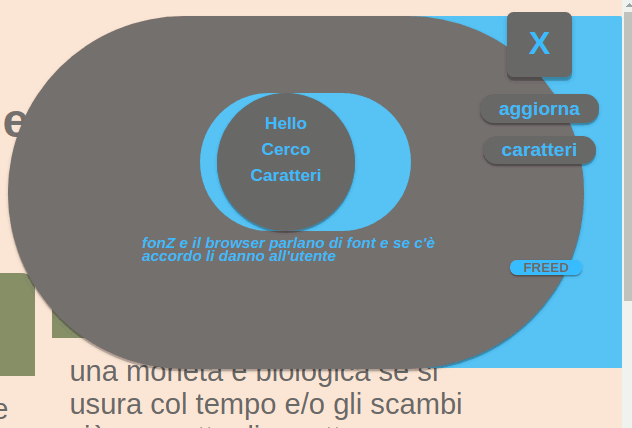

# fonZ

fonZ 
searches among the installed fonts  
and let the user choose  
among those found  
which one to use  
for the website  

### html css javascript

fonZ for now has 4 files  
1 html example page with css embedded for the page and fonZ  
2 js one for fonZ application and the other for a list of fonts - only the name  
1 image svg optional for the background  

## released versione beta zeta 5  
restyling  
now fonZ is to right and the scroll bar to left  
panels change form when fonts are written  
button are hidden when the script is searching for fonts  
more fonts  

## released version beta zeta 4
speed because the script was braked  
issue now too many movements  
progress bar  
list redeployed  
fonts added  
and something always is forgotten

## Usage
download the files and put the scripts in a folder named js  
and the image in his img folder  
or use other names or locations and change the links in the example page  
or  
download and unzip the zip file  
open the example page in a browser and run the script  

fonZ can run in any location with or without a webserver  
without server fonZ loss some functions and the user cannot save his choice  
because fonZ need some cookie for stored the name of fonts found  
if it finds something  

## Usage without the example page
put the code at bottom of example page in your page  
put the css code of fonZ in a css file or embedd it  
link the scripts  
*update* done though  
the script modify the font of body tag  
others directive should be prevail  
issue need testing

## Add more font names
add the names to the script for fonts where are stored the existing font names and in the same format i.e. 'times','another name of font','serif','etc etc',  
for now fonZ support until 324 fonts  
but is quite simple enlarge that limit 

### notice - version beta zero 2 was labelled bugged
new version fixed bugs and has a new button  

## how it works  
fonZ writes a phrase in the style of the searched font  
comma ungraceful degradation to a generic font  
and the same phrase with that generic font  
then it reads the width of those phrases using the offset.Width property  
if they match it means almost nothing  
but  
**if they don't it means just a pre-installed font**  
now fonZ stores new name and creates a new font button  
   
  

         

 
## [demo shoud be runs the most recent version of fonZ](https://fonz.esogeomedismo.org)

